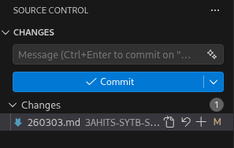

# Arbeitsbericht

- Datum: 03.03.2026
- Thema: Arbeitsberichte über GitHub Pages
- Name: Christian Schützner
- Klasse: 3AHITS
- Fach: ITSE

# GitHub

Anlegen einer neuen Repositority:
- Bei GitHub unter "Repositorities" bei deinem Profil
- New
- Wichtig ist "Add README" zu aktivieren, bis auf Repositority Name ist sonst nichts wichtig
- Im README kann man dann ein Text eingeben, der bei der Hauptpage dann erscheint

# VS Code

Download von [VS Code für Linux](https://code.visualstudio.com/docs/setup/linux)
- Die Debian Datei herunterladen
- mit cd in Ordner der Datei navigieren
- folgenden Befehl eingeben in shell:
```sh
sudo apt install .code/code_1.109.5-1771531656_amd64.deb
```

# VS Code mit GitHub verbinden

Zuerst muss man die entsprechende Ordnerstruktur lokal erstellen, auf dem die Repository von GitHub dann kopiert wird. Auf VS Code kann man dann ein Terminal öffnen (oben rechts bei Ansichten)
```
git clone < github repository link>
```
Für den Link nimmt man den GitHub Link auf der "Hauptpage" direkt. z.B. https://github.com/ryangoslig123/3AHITS-SYTB-SchuetznerChristian

# Git konfigurieren
Um Änderungen auf GitHub zu veröffentlichen, muss man zuerst Git einrichten auf VS Code selbst. Dazu klickt man das Source Control Symbol in VS Code links. Um Änderungen zu übertragen und eine Version deiner Datei zu erstellen, sagt man unter Git "Commit". Diese Funktion ist in VS Code unter Source Control zu finden.  
Davor muss allerdings der username und die useremail konfiguriert werden per shell, da sonst eine Fehlermeldung kommt. Dazu kann man wieder die integerierte shell in VS Code verwenden:
```sh
git config --global user.name "Name"

git config --global user.email "E-Mail"
```
Danach dürfte Commit funktionieren. Gestaged wird dabei automatisch, und danach kommt nochmal ein Button "Sync Changes". Hierbei wird "gepushed" (der Begriff für die Übertragung der Änderung auf GitHub).