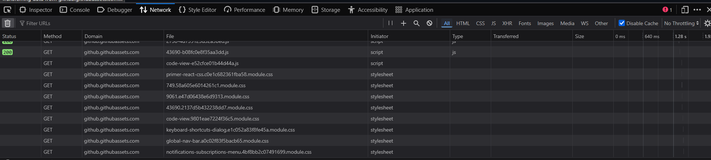

# Arbeitsbericht

- Datum: 17.03.2026
- Thema: cURL + Notenmanagement
- Name: Christian Schützner
- Klasse: 3AHITS
- Fach: ITSE

# Browser Developer Tool

Die Developer Tools (F12) im Browser sind vermutlich bekannt. Neu in dieser Übung allerdings ist das Netzwerk Tab (Im Firefox). Dort kann man die Kommunikation zwischen Server und Client betrachten, quasi ein Live Protokoll. 

Bei jedem Eintrag in der Liste kann man dan den Header, Request und Response auslesen.

# Notenmanagement

Auf meinem Computer konnte ich mich nicht mit der Notenmanagement Seite verbinden.