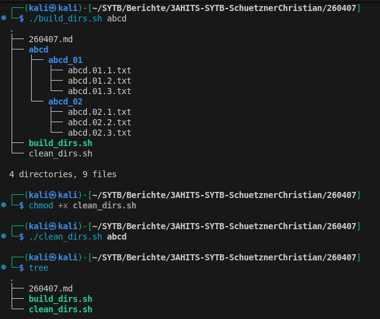
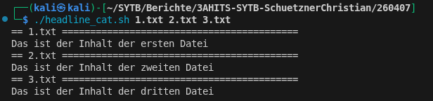

# Arbeitsbericht

- Name: Christian Schützner
- Datum: 07.04.2026
- Thema: Shell Script (Argumente und for-Schleifen)
- Klasse: 3AHITS

# Generelle Informationen
### Argumente
Beim Aufruf eines shell Scripts können Argumente übergeben werden (getrennt mit Leerzeichen), die im Script mit $1, $2, etc. aufgerufen werden können. mit $@ können alle Argumente aufgerufen werden.
### for-in-Schleifen
In einer for-in-Schleife werden die Argumente nacheinander abgearbeitet. Mit for i in $@ wird die Schleife z.B. für jedes übergebene Argument einmal ausgeführt, wobei i in jedem Durchgang den Wert des nächsten Arguments annimmt.

# Übung (Directory Struktur)
build_dirs.sh:
```sh
mkdir $1

for i in 01 02
do
    mkdir $1/$1_$i

    for j in 1 2 3; do
        > $1/$1_$i/$1.$i.$j.txt
    done
done

tree
```
Zuerst wird die Directory mit $1 erstellt (das erste Argument, das übergeben wird)  
Dann wird in der for-Schleife die Unterverzeichnisse erstellt, für die Namensgebung werden i und j verwendet (j für Textdateien in der verschachtelten Schleife)  
  
clean_dirs.sh:
```
rm -rf $1
```


# Übung (Skript Generator)

```sh
#!/bin/bash
FILE = $1
echo "#!/bin/env" > $FILE.sh
echo "echo \"$FILE Skript\"" >> $FILE.sh
chmod +x $FILE.sh
```
Zuerst wird aus Schönheitsgründen das übergebene Argument in eine FILE Variable gespeichert.  
Dann wird die She-Bang Zeile eingefügt, die echo Zeile, und der Flag wird gesetzt.

# Übung (Headline Cat)
```sh
#!/bin/bash
> result.txt

for file in $@
do
    echo "== $file ==========================================" >> result.txt
    cat $file >> result.txt
    echo "" >> result.txt
done
cat result.txt
```
Zuerst wird die Datei erstellt, danach die übliche Argument Schleife, die erzeugte Überschrift wird dann in result.txt gespeichert.  
Dann wird der Inhalt der Textdateien ausgegeben und in result.txt gespeichert, ebenso eine Leerzeile.


# Übung (RANDOM)

```
#!/bin/bash

for file in $@
do
    cp $file $file.$RANDOM
done
```
Wieder die übliche Argument Schleife, mit cp (copy) wird dann der erste Parameter genommen und in das zweite ($file.$RANDOM) kopiert.