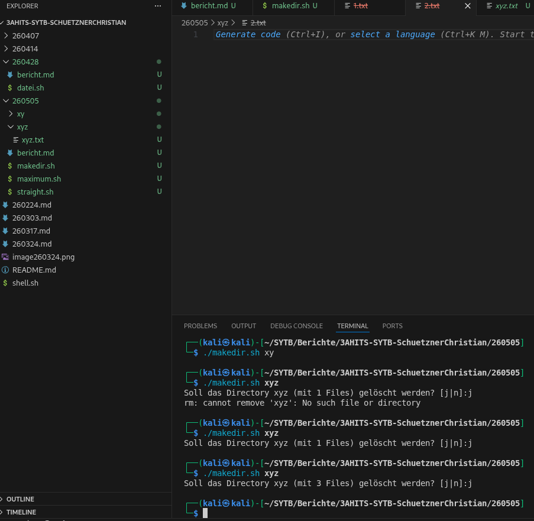

# Arbeitsbericht

- Name: Christian Schützner
- Datum: 28.04.2026
- Thema: test Kommando
- Klasse: 3AHITS

# Theorie
Das if statement in Bash/Shellscript zeigt meiner Meinung nach wenig Unterschied im Vergleich zu C/C++. Wie bei Test müssen eckige Klammern verwendet werden, und der Anweisungszweig wird mit then gekennzeichnet. (oder else, allerdings kein else then). Die schließende geschwungene Klammer aus C ist im Shellscript quasi fi, dass das Ende der if-Anweisung bedeutet.Wenn man arithmetische Funktionen anwenden will, braucht man dazu 2 runde Klammern. Bei % und || müssen beide Parameter mit eckigen Klammern gekennzeichnet werden ([] && []). 

# Maximum

```sh
#!/bin/bash

x=$1
y=$2

if((x != y))
then
    if((x>y))
    then
    echo "$x"
    else
    echo "$y"
    fi
else
echo "Die Zahlen sind gleich groß"
fi
```

Dazu braucht man die zwei runden Klammern (Shell Arithmethic). Zuerst wird geprüft, ob die Zahlen gleich groß sind. Wenn nicht, wird mit if/else geprüft welche Zahl größer ist. Wichtig ist in diesem Skript die She-Bang Zeile einzubinden (Bash), da in der normalen Shell die Arithmethischen Klammern nicht funktionieren.

# Gerade/Ungerade

```sh
#!/bin/bash

NUMBER=$1

if (( NUMBER % 2 == 0 ));
then
echo "Die Zahl $NUMBER ist gerade"
else
echo "Die Zahl $NUMBER ist ungerade"
fi
```

Genau wie vorher braucht man die zwei runden Klammern (Shell Arithmethic). Die übliche Prüfung für gerade/ungerade geht durch modulo 2, und wenn kein Rest bleibt, ist die Zahl gerade. Auch hier muss die She-Bang Zeile wieder eingebunden werden, da in der normalen Shell die Arithmethischen Klammern nicht funktionieren.

# Directory
```sh
#!/bin/bash

DIR=$1 #Verzeichnisvariable

if [ -d "$DIR" ] #prüfen ob das Verzeichnis exestiert
    then
    COUNT=$(find "$DIR" -type f | wc -l) #Filecount Variable
    read -p "Soll das Directory $DIR (mit $COUNT Files) gelöscht werden? [j|n]:" auswahl #Read speichert folgende Benutzereingabe in die Variable auswahl
    
    if [ "$auswahl" == "j" ] #ja, soll gelöscht werden
    then
        rm -rf "$DIR"   #rm -rf löscht alle Dateien im Verzeichnis DIR und DIR selbst
    elif [ "$auswahl" == "n" ] #nein, soll nicht gelöscht werden. 
    then
        exit 0 #Das Skript wird beendet
    fi
fi

mkdir "$DIR" #erstellen
echo "$DIR" > "$DIR/$DIR.txt" #Textdatei mit parameter
```
Wichtig ist innerhalb den eckigen Klammern eine Leerzeile Abstand zu lassen. Ebenfalls muss elif verwendet werden, man kann nicht else if oder elseif schreiben.  

read info: https://www.howtoforge.de/anleitung/der-linux-read-command/  
filecount: https://dev.to/ibrahimalanshor/2-ways-to-count-files-in-a-linux-directory-using-bash-7a7  

  
